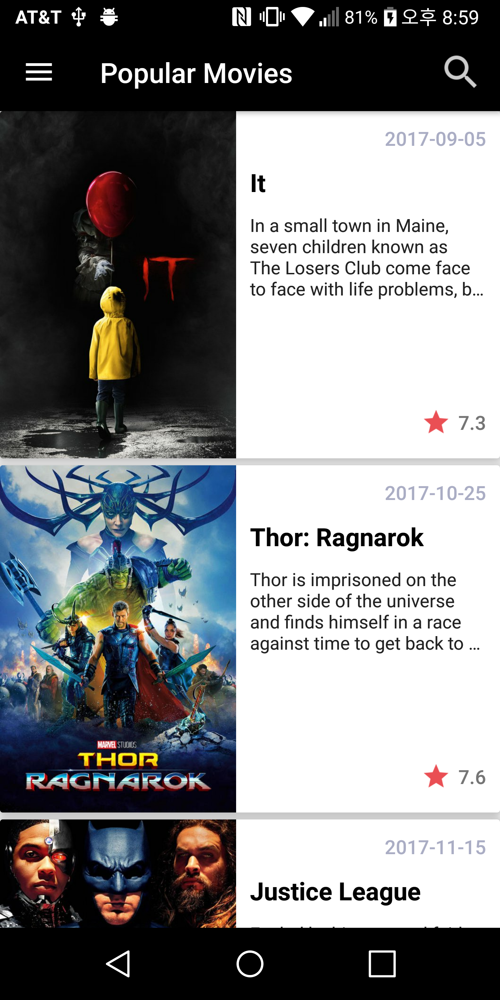
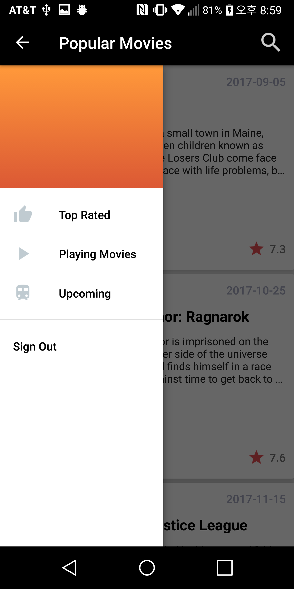
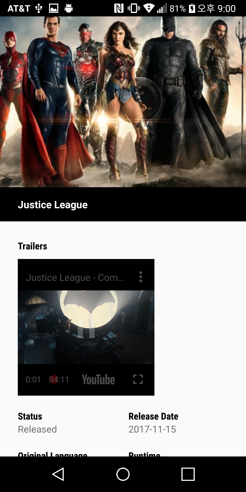
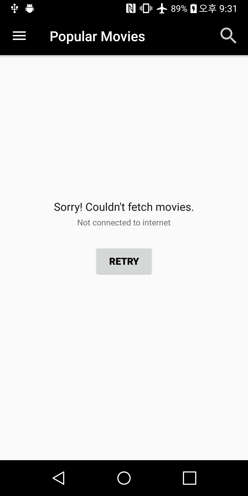
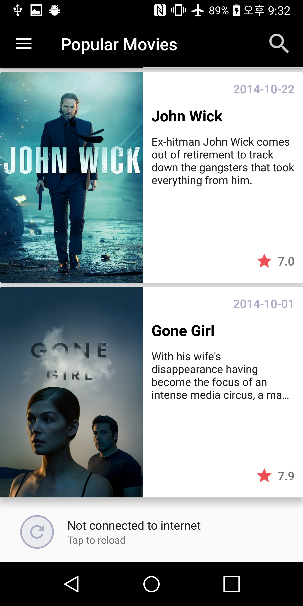

# MovieApp

This is a MovieApp that I made from scratch and allows users to discover list of movies.
I used TMDB API to retrieve movies. You must use your own API key in order to build the app. 

# Features

* Sort movies by popularity, rating, current playing and upcoming 
* View a particular movie detail
* View movie trailers through youtube

## ScreenShots

   

 

## Error handling

 

## Libraries Used 
<ul>
  <li>Retrofit</li>
  <li>GSON</li>
  <li>Picasso</li>
  <li>Kenbursview</li>
  <li>MaterialSearchView</li>
  <li>YoutubePlayerApi(for trailer)</li>
</ul>

